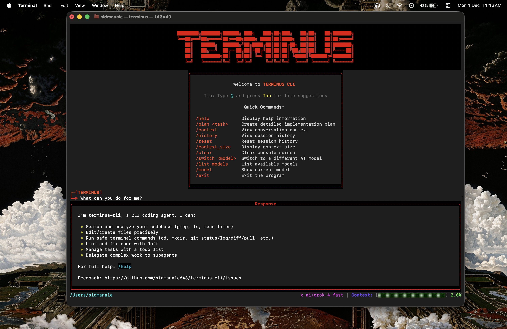

# Terminus CLI

> AI-powered development companion for the command line



[](https://python.org)
[](LICENSE)
[](https://github.com/sidmanale643/terminus-cli)

Terminus CLI is an AI-powered tool that automates coding tasks, manages files, and streamlines your development workflow directly from the command line.    

## Features

- **Modern Terminal UI**: Built with React/Ink for a rich, interactive experience (default); classic Rich/prompt_toolkit UI available via `--classic`
- **Multi-Agent Architecture**: Coordinator spawns specialized subagents to handle parallel tasks and complex workflows
- **Codebase Understanding**: Scans your entire codebase to provide context-aware suggestions and understand complex project structures
- **Natural Language Tasks**: Describe tasks in plain English—Terminus interprets and executes them seamlessly
- **File Operations**: AI-guided reading, editing, creation, and refactoring of files with precision and safety
- **Code Search**: Ripgrep-powered search to locate patterns, dependencies, and issues across your project
- **LLM Integration**: Supports Groq, OpenRouter, and Google Gemini models for tailored performance and cost efficiency
- **Session Memory**: Maintains conversation history and context for multi-step development tasks without restarting
- **Context Compaction**: Automatically compresses long conversations to stay within model context limits
- **Built-in Tools**: Includes linting with Ruff, todo tracking, web search (Tavily), secure system command execution, and sandboxed code execution
- **Worker Management**: Spawn, monitor, and collect results from background worker agents in parallel
- **Skills System**: Load specialized skill definitions from `.skills/` directories to augment agent capabilities
- **Project Customization**: Adapts behavior via `terminus.md` files for coding standards, preferences, and workflows
- **Observability**: Optional Langfuse integration for tracing and monitoring agent runs

## Quick Start

### Prerequisites
- Python 3.11 or higher
- [uv](https://docs.astral.sh/uv/) (recommended for fast dependency management; pip works too)
- Node.js (for React/Ink UI; optional if using `--classic`)

### Installation

#### Option 1: Global Install with pipx (Recommended)

pipx provides isolated, system-wide access:

```bash
# Install pipx (if needed)
# macOS: brew install pipx
# Ubuntu: python3 -m pip install --user pipx
pipx ensurepath

# Install from GitHub
pipx install git+https://github.com/sidmanale643/terminus-cli.git

# Or from local directory (after cloning)
# pipx install -e /path/to/local/terminus-cli
```

#### Option 2: Virtual Environment Setup (Development)

```bash
git clone https://github.com/sidmanale643/terminus-cli.git
cd terminus-cli

# Create and activate virtual environment
uv venv
source .venv/bin/activate  # On Windows: .venv\Scripts\activate

# Install dependencies
uv sync

# Install in editable mode
uv pip install -e .

# Install React UI dependencies
cd ui/react && npm install && cd ../..

# Setup environment file
cp .env.sample .env
# Edit .env with your API keys (see below)
```

To run: `terminus` (if installed) or `python -m src.main`.

### Configuration

Create or edit `.env` in your project root or home directory:

```env
# Required for LLM access
GROQ_API_KEY=your_groq_key_here
OPENROUTER_API_KEY=your_openrouter_key_here
GEMINI_API_KEY=your_gemini_key_here

# Optional: Web search
TAVILY_API_KEY=your_tavily_key_here

# Optional: Observability (Langfuse)
LANGFUSE_PUBLIC_KEY=pk-lf-...
LANGFUSE_SECRET_KEY=sk-lf-...
LANGFUSE_HOST=https://cloud.langfuse.com

# Optional: Daytona sandbox
DAYTONA_API_KEY=dtn-...

# Optional: Default model
DEFAULT_MODEL=openrouter/google/gemma-4-31b-it:free
```

Obtain keys from:
- [Groq Console](https://console.groq.com/keys)
- [OpenRouter](https://openrouter.ai/keys)
- [Google AI Studio](https://aistudio.google.com/app/apikey)
- [Tavily](https://app.tavily.com/home)
- [Langfuse](https://cloud.langfuse.com)
- [Daytona](https://www.daytona.io)

## Usage Examples

### Starting Terminus

Navigate to your project and launch:

```bash
cd /path/to/your/project
terminus
```

This opens an interactive session where Terminus uses the current directory as context.

### Interactive Session

```bash
terminus> List all Python files in the src directory
terminus> Explain how the agent.py file works
terminus> Add a new function to utils.py for data validation
```

### One-Shot Queries

For single commands without interactive mode:

```bash
terminus "Search for unused imports in the codebase"
terminus "Generate a unit test for the login function in auth.py"
```

### Referencing Files

Use `@` to point to specific files:

```bash
terminus "Optimize the code in @src/agent.py"
terminus "Document the classes in @src/models/schema.py"
```

### Classic UI

If you prefer the classic Rich/prompt_toolkit interface:

```bash
terminus --classic
```

## Built-in Commands

Available in interactive mode:

| Command | Description |
|---------|-------------|
| `/help` | Display help and available commands |
| `/context` | Show current session context |
| `/history` | View last 5 conversation messages |
| `/reset` | Reset context and start over |
| `/exit` | Exit the application |
| `/clear` | Clear the screen |
| `/context_size` | Display current context size |
| `/compact` | Compress conversation context to free tokens |
| `/models` | Switch AI model interactively |
| `/connect` | Configure provider API key |
| `/plan` | Create an implementation plan |
| `/skills` | List available skills in `.skills/` directory |
| `/skill <name>` | Load a skill into the current context |
| `/copy` | Copy last response to clipboard |
| `/init` | Generate or update AGENTS.md |

### Custom Instructions with `terminus.md`

Tailor Terminus behavior per project by creating `terminus.md` in the root:

```markdown
# Project-Specific Instructions

## Coding Standards
- Use type hints everywhere (PEP 484)
- Adhere to PEP 8 formatting
- Prefer async patterns for I/O operations

## Preferences
- Avoid global variables
- Use existing dependencies from pyproject.toml
- Prioritize security in file operations
```

Terminus loads this file automatically, incorporating instructions into its responses.

## Architecture Overview

```
terminus-cli/
├── pyproject.toml          # Dependencies and build config
├── uv.lock                 # Lockfile for dependencies
├── src/
│   ├── main.py             # CLI entry point
│   ├── agent.py            # Core AI agent loop (tool-calling, streaming, context)
│   ├── coordinator.py      # Multi-agent coordinator for parallel task delegation
│   ├── multi_agent.py      # Multi-agent orchestration utilities
│   ├── context_manager.py  # Context compaction and size tracking
│   ├── session_manager.py  # SQLite-backed session history
│   ├── constants.py        # Model defaults and constants
│   ├── utils.py            # Shared utilities (file refs, tool merging)
│   ├── commands/           # Slash command registry and palette UI
│   ├── tools/              # Tool implementations
│   │   ├── read_file.py
│   │   ├── read_multiple_files.py
│   │   ├── edit_file.py
│   │   ├── multi_edit.py
│   │   ├── create_file.py
│   │   ├── grep.py
│   │   ├── ls.py
│   │   ├── cmd_executor.py
│   │   ├── lint.py
│   │   ├── web_search.py
│   │   ├── todo.py
│   │   ├── subagent.py
│   │   ├── spawn_worker.py
│   │   ├── spawn_workers_batch.py
│   │   ├── stop_worker.py
│   │   ├── list_workers.py
│   │   ├── await_workers.py
│   │   ├── get_worker_result.py
│   │   ├── ask_question.py
│   │   ├── send_notification.py
│   │   └── sandbox.py
│   ├── llm_service/        # LLM client integrations (Groq, OpenRouter, Gemini)
│   ├── models/             # Pydantic models (LLM configs, tool schemas)
│   ├── prompts/            # System/planner/coordinator/compaction prompt templates
│   ├── observability/      # Langfuse tracing integration
│   └── __init__.py
├── ui/
│   ├── react/              # React/Ink frontend (TypeScript)
│   │   ├── src/main.tsx
│   │   ├── src/components/  # Ink UI components (Banner, InputBox, etc.)
│   │   ├── src/bridge/        # Socket IPC, protocol, and state modules
│   │   └── package.json
│   ├── react_display.py    # Python ↔ React bridge (Unix socket IPC)
│   ├── display.py          # Classic Rich/prompt_toolkit UI
│   └── streaming.py        # Streaming output handler
├── .skills/                # Skill definitions (SKILL.md with YAML frontmatter)
├── .db/                    # SQLite chat history (auto-created)
├── README.md
├── .env.sample             # Config template
└── .gitignore
```

The agent uses a **tool-calling architecture**, delegating tasks to specialized functions for safe, precise operations. A **coordinator layer** can spawn **subagents** to handle independent tasks in parallel.

## Development Guide

### Running the Application

```bash
# Interactive mode (React UI by default)
terminus

# One-shot query
terminus "explain the codebase"

# Classic Rich/prompt_toolkit UI
terminus --classic

# Direct Python execution (useful for debugging)
python -m src.main --debug
```

### React UI Development

```bash
cd ui/react
npm install   # if node_modules missing
npm run build # TypeScript check (tsc)
npm run dev   # Run via tsx (standalone, for testing)
npm run start # Run compiled dist/main.js
```

### Testing

```bash
# Async system tests
python tests/test_async_system.py

# React UI socket smoke test
python test_react.py

# React UI component test
python test_react_ui.py
```

### Lint / Format

```bash
ruff check src/    # lint
ruff format src/   # format
```

### Adding Tools or Features

1. Implement the tool in `src/tools/`
2. Register it in `src/tools/tool_registry.py`
3. Update `src/prompts/` if behavior changes
4. Update `README.md` if user-facing

## Contributing

We welcome contributions! Please:

1. Fork the repo and create a feature branch
2. Ensure code passes linting and tests
3. Update documentation
4. Submit a PR with a clear description

See [CONTRIBUTING.md](CONTRIBUTING.md) for details (create if needed).

## License

This project is licensed under the MIT License - see [LICENSE](LICENSE).

## Support and Feedback

- **Issues**: [GitHub Issues](https://github.com/sidmanale643/terminus-cli/issues)
- **Discussions**: [GitHub Discussions](https://github.com/sidmanale643/terminus-cli/discussions)
- **In-App**: Type `/help` for quick assistance
- **Feedback**: Report at the issues page above

---

Terminus CLI: Empowering CLI-driven development with AI intelligence.
