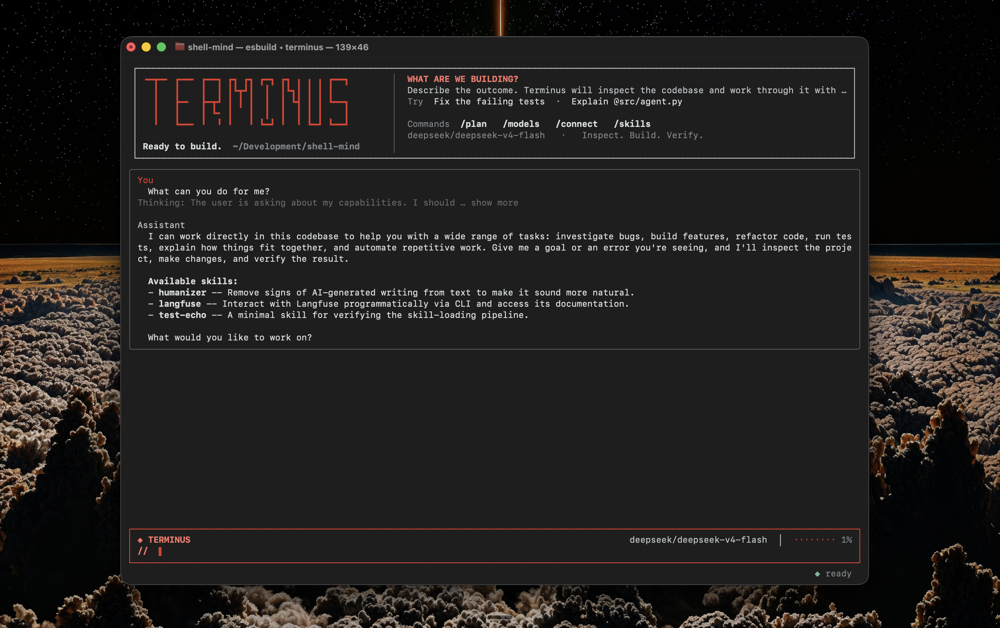

# Terminus CLI

> An AI coding agent that works with you directly in the terminal.



[](https://www.python.org/)
[](https://github.com/vadimdemedes/ink)
[](https://github.com/sidmanale643/terminus-cli)

Terminus CLI is a development companion for exploring codebases, planning changes, editing files, running commands, and completing multi-step engineering tasks. It combines a Python agent runtime with a React and Ink terminal interface, persistent conversation history, configurable model providers, and an extensible tool system.

Terminus runs in the directory where you launch it. Ask a question in plain language, reference files with `@path`, or let the agent inspect and modify the project with its built-in tools.

## Highlights

- **Interactive terminal UI:** A responsive React and Ink interface with streamed responses, tool activity, status updates, todo panels, and model and context information.
- **Autonomous agent loop:** The model can inspect the repository, choose tools, evaluate their results, and continue until the task is complete.
- **Codebase operations:** Read, create, and edit files; search text and paths; list directories; and run shell commands.
- **Safe planning mode:** `/plan` limits the agent to read-only discovery, web search, questions, skills, and todo tools.
- **Groq and OpenRouter support:** Switch between the registered providers and available models without leaving the app.
- **Persistent sessions:** Conversation history is stored locally in SQLite and remains available across multi-step work.
- **Automatic context management:** Large tool output is trimmed at 50% of the model context window, and conversations are compacted at 75%.
- **MCP integration:** Connect local Model Context Protocol servers and expose their tools to the agent.
- **Skills and project instructions:** Load reusable skills and repository guidance from the working tree.
- **Optional integrations:** Tavily web search, Daytona sandboxes, and Langfuse observability.
- **Interruptible work:** Press `Ctrl+C` once to cancel the current turn. Press it again within two seconds to exit.

## How Terminus Works

```text
Your request
    │
    ▼
Agent chooses an action ──► Tool runs in the current project
    ▲                              │
    └──────── result returned ─────┘
    │
    ▼
Final response
```

The agent can repeat this cycle for up to 50 iterations. Tool calls and outputs are visible in the terminal, so you can follow what it is doing. The current directory defines the project scope and is also where Terminus looks for configuration such as `.env`, `AGENTS.md`, skills, and `terminus.mcp.yaml`.

## Requirements

- Python 3.11 or newer
- [uv](https://docs.astral.sh/uv/)
- Node.js and npm
- A Groq or OpenRouter API key

## Installation

Clone the repository and install the Python package and terminal UI dependencies:

```bash
git clone https://github.com/sidmanale643/terminus-cli.git
cd terminus-cli

uv sync
uv pip install -e .

cd ui/react
npm install
cd ../..

cp .env.sample .env
```

The editable install is required. `uv sync` alone does not install the `terminus` command from the local checkout.

Add at least one provider key to `.env`:

```dotenv
# Default provider
GROQ_API_KEY=your_groq_api_key

# Optional second provider
OPEN_ROUTER_API_KEY=your_openrouter_api_key
```

> **Important:** Use `OPEN_ROUTER_API_KEY` with the underscore. The current `.env.sample` uses `OPENROUTER_API_KEY`, but the OpenRouter provider and `/connect` command read `OPEN_ROUTER_API_KEY`.

Then start Terminus from the project you want it to work on:

```bash
cd /path/to/your/project
terminus
```

## Usage

### Interactive mode

Run `terminus` without a query to open the interactive interface:

```bash
terminus
```

Example prompts:

```text
Explain how authentication works in this repository.
Find the cause of the failing request and fix it.
Add validation to the settings endpoint and run the relevant checks.
Review the current changes for regressions.
```

### One-shot mode

Pass a query as arguments to complete one task and exit:

```bash
terminus "Summarize this codebase"
terminus "Find unused imports under src"
terminus "Explain the request flow in @src/main.py"
```

You can also use the module entry point from the repository:

```bash
uv run python -m src.main "Explain the project architecture"
```

### File references

Prefix a relative path with `@` to load its contents into your request:

```text
Explain @src/agent.py
Compare @src/llm_service/groq.py and @src/llm_service/openrouter.py
Update error handling in @src/mcp_bridge.py
```

Missing or unreadable references are reported as warnings. File references are resolved from the directory where Terminus was launched.

### Plan mode

Use `/plan` when you want investigation and an implementation plan without file changes or command execution:

```text
/plan add support for a new LLM provider
```

Plan mode can list files, search paths and text, read files, search the web, load skills, ask questions, and manage todos. It cannot edit or create files, execute shell commands or sandboxes, or delegate implementation.

## Commands

These commands are available in interactive mode:

| Command | What it does |
| --- | --- |
| `/help` | Show the command reference. |
| `/plan <task>` | Investigate a task with the read-only planning tool set. |
| `/context` | Print the current in-memory conversation context. |
| `/history` | Show the five most recent session messages. |
| `/context_size` | Show the current estimated context size. |
| `/compact` | Summarize a long conversation and reduce its context usage. |
| `/reset` | Clear the current session and refresh MCP tools. |
| `/clear` | Clear and redraw the terminal interface. |
| `/models` | Open the model picker and switch the active model and provider. |
| `/connect` | Select Groq or OpenRouter and save its API key to the local `.env`. |
| `/copy` | Copy the last assistant response to the system clipboard. |
| `/skills` | List skills discovered in the project and built-in `.skills/` directories. |
| `/skill [name]` | Select or load a skill into the current conversation. |
| `/init` | Generate or update an `AGENTS.md` guide for the current project. |
| `/mcp status` | Show configured MCP servers, connection state, and tool counts. |
| `/mcp refresh` | Reconnect to configured MCP servers and reload their tools. |
| `/mcp tools` | List discovered MCP tools by server. |
| `/exit` | Exit Terminus. `exit`, `quit`, and `q` are also accepted. |

Entering an unknown slash command shows an error. The UI also presents command suggestions as you type.

## Built-in Agent Tools

| Capability | Tools and behavior |
| --- | --- |
| Browse the project | List directories and find files with `ls` and glob patterns. |
| Search code | Search file contents with ripgrep-backed regular expressions. |
| Read files | Read full files or selected line ranges. |
| Change files | Create new files and apply targeted edits to existing files. |
| Run commands | Execute shell commands in the project with cancellation support. |
| Use a sandbox | Run isolated tasks through Daytona when configured. |
| Search the web | Query Tavily when `TAVILY_API_KEY` is configured. |
| Track work | Create, read, and update a structured todo list during a task. |
| Ask questions | Pause for information when a decision requires user input. |
| Delegate | Start a focused subagent for a bounded part of a task. |
| Load skills | Discover and inject a selected `SKILL.md` into the conversation. |
| Use MCP tools | Call tools discovered from configured MCP servers. |

The shell tool is instructed to reject destructive commands and package installation without explicit user confirmation. Its commands have a 30-second default timeout and a 120-second maximum. The Daytona tool executes code in a separate cloud sandbox.

## Model Providers

Terminus currently registers two providers:

| Provider | Environment variable | Notes |
| --- | --- | --- |
| Groq | `GROQ_API_KEY` | Default provider. The default model is `openai/gpt-oss-120b`. |
| OpenRouter | `OPEN_ROUTER_API_KEY` | Provides access to the OpenRouter models listed by the model picker. |

Use `/connect` to save a key to the current project's `.env`, then use `/models` to select a model. Gemini-branded and other third-party models may be available through OpenRouter, but there is no direct Gemini provider in the current codebase.

## Configuration

Terminus loads environment variables from `.env`:

```dotenv
GROQ_API_KEY=your_groq_api_key
OPEN_ROUTER_API_KEY=your_openrouter_api_key

# Optional web search
TAVILY_API_KEY=your_tavily_api_key

# Optional Daytona sandbox
DAYTONA_API_KEY=your_daytona_api_key

# Optional Langfuse tracing
LANGFUSE_PUBLIC_KEY=pk-lf-...
LANGFUSE_SECRET_KEY=sk-lf-...
LANGFUSE_HOST=https://cloud.langfuse.com
```

When Langfuse is configured, Terminus checks connectivity at startup and warns if traces cannot be delivered. `LANGFUSE_BASE_URL` is also accepted as an alternative host variable.

### Project instructions

Terminus can include repository guidance in its system prompt:

- `AGENTS.md` provides authoritative build steps, architecture notes, conventions, and agent instructions. Terminus searches the project root and its parent directories.

Run `/init` to have Terminus inspect the current repository and generate or update `AGENTS.md`.

### Skills

Skills are reusable instructions stored in the current project's `.skills/` directory or Terminus's own `.skills/` directory. Each skill is defined by a `SKILL.md` file with YAML front matter containing its name, description, and trigger.

```text
.skills/
└── security-review/
    └── SKILL.md
```

Use `/skills` to inspect discovered skills and `/skill security-review` to load one for the current conversation.

### MCP servers

Create `terminus.mcp.yaml` in the directory where you launch Terminus:

```yaml
servers:
  filesystem:
    command: npx
    args:
      - -y
      - "@modelcontextprotocol/server-filesystem"
      - .
    cwd: .
    env:
      EXAMPLE_TOKEN: "${EXAMPLE_TOKEN}"
    timeout_seconds: 60
```

Each server supports `command`, `args`, `cwd`, `env`, `timeout_seconds`, `enabled`, and an optional `tool_prefix`. Relative working directories are resolved from the project directory, and `${NAME}` values are interpolated from the environment. MCP tools are discovered at startup and namespaced to avoid collisions.

## Sessions and Context

Terminus stores chat history in `.db/chat_history.db` using SQLite. The active session is also maintained in memory for fast access.

To keep long-running tasks within a model's context window:

- raw tool output is trimmed when usage reaches 50%;
- automatic conversation compaction starts at 75%;
- `/compact` can compact the conversation manually;
- `/reset` clears the active session and starts fresh.

These limits are based on the context size declared for the selected model.

## Architecture

```text
terminus-cli/
├── src/
│   ├── agent.py             # Tool-calling loop and context orchestration
│   ├── cli/                 # CLI controller and terminal helpers
│   ├── commands/            # Interactive command registry
│   ├── context_manager.py   # Context measurement and compaction
│   ├── llm_service/         # Groq and OpenRouter providers
│   ├── mcp_bridge.py        # MCP configuration, sessions, and tool adapters
│   ├── models/              # Pydantic model and tool schemas
│   ├── observability/       # Optional Langfuse integration
│   ├── prompts/             # Agent, plan, init, and compaction prompts
│   ├── session_manager.py   # SQLite-backed conversation history
│   └── tools/               # Built-in agent tools
├── ui/
│   ├── react_display.py     # Python-to-React bridge
│   └── react/
│       └── src/             # React and Ink interface
├── tests/                   # Python tests
├── pyproject.toml           # Package metadata and Python dependencies
└── uv.lock                  # Reproducible Python dependency lockfile
```

The Python process starts the React UI and communicates with it through a JSON-line protocol over a Unix domain socket. React keeps direct ownership of terminal input and rendering, while the Python bridge owns protocol state and forwards agent events.

## Development

Set up an editable development environment:

```bash
uv sync
uv pip install -e .

cd ui/react
npm install
cd ../..
```

Run the application:

```bash
terminus
terminus "explain the codebase"
uv run python -m src.main
```

Check Python code:

```bash
uv run ruff check src/
uv run ruff format --check src/
```

Run the main test suites:

```bash
uv run python tests/test_async_system.py

cd ui/react
npm run build
npm run test
```

Additional integration and smoke tests are available in `tests/` and the repository root. Some of them require provider keys or a working terminal environment.

### Adding a tool

1. Add a `ToolSchema` implementation under `src/tools/`.
2. Export it from `src/tools/__init__.py`.
3. Register it in `ALL_TOOL_CLASSES` in `src/tools/tool_registry.py`.
4. Add it to `PLAN_MODE_TOOL_NAMES` only if it is safe for read-only planning.
5. Update prompts and documentation when the user-facing behavior changes.

## Contributing

Contributions are welcome. Before opening a pull request:

1. Fork the repository and create a focused branch.
2. Keep changes small and consistent with the existing architecture.
3. Run the relevant Python and React checks.
4. Update user-facing documentation for behavior changes.
5. Describe the problem, the approach, and how you verified the result in the pull request.

Use [GitHub Issues](https://github.com/sidmanale643/terminus-cli/issues) for bug reports and feature proposals.

## License

This repository does not currently include a license file. Until a license is added, copyright law reserves reuse and redistribution rights to the repository owner. If you maintain this project and intend it to be openly reusable, add an OSI-approved license such as MIT, Apache-2.0, or GPL-3.0.

## Support

- Run `/help` inside Terminus for the command reference.
- Search or open a report in [GitHub Issues](https://github.com/sidmanale643/terminus-cli/issues).
- Include your Python version, Node.js version, provider, selected model, and a minimal reproduction when reporting a bug.
