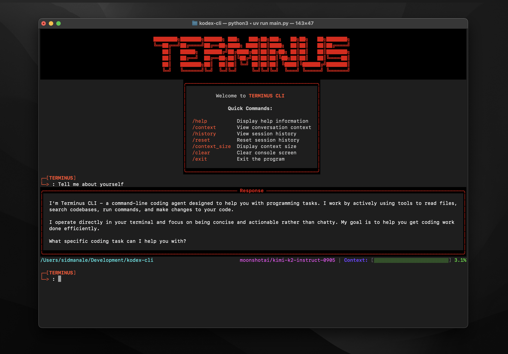

# Terminus CLI

AI-powered CLI agent with intelligent automation for coding tasks, file operations, and development workflows.


## Quick Start

```bash
git clone https://github.com/sidmanale643/terminus-cli.git
cd terminus-cli
uv venv && source .venv/bin/activate
uv sync  # or: uv pip install -e .
cp .env.sample .env  # Add your API keys
python main.py
```

## API Keys

Create `.env` file from the sample:
```bash
cp .env.sample .env
```

Then edit `.env` with your API keys:
```env
GROQ_API_KEY=your_groq_api_key_here              # Primary LLM (default provider)
OPEN_ROUTER_API_KEY=your_openrouter_api_key_here  # Alternative LLM provider
```

Get keys: [Groq](https://groq.com) | [OpenRouter](https://openrouter.ai)

## Usage

**Interactive mode:**
```bash
uv run main.py
```

**Single query:**
```bash
uv run main.py "List Python files in current directory"
```

**Available Commands:**
- `/help` - Display help information
- `/context` - View current conversation context
- `/history` - View recent session history
- `/reset` - Reset session history
- `/context_size` - Display context usage
- `/clear` - Clear console screen
- `/exit` - Exit the program (also: `exit`, `quit`, `q`)

## Tools

- **Command execution** - Run shell commands
- **File operations** - Create, read, edit files
- **Grep search** - Search through files
- **Directory listing** - Browse file structure
- **Linting** - Code quality checks
- **Task management** - Track todos
- **Sub-agent delegation** - Delegate complex tasks

## Architecture

```
terminus-cli/
├── main.py              # CLI interface & entry point
├── agent.py             # Core agent logic & orchestration
├── session_manager.py   # Session & history management
├── constants.py         # Configuration constants
├── utils.py             # Utility functions
├── llm_service/         # LLM provider integrations
│   ├── service.py       # LLM service manager
│   ├── groq.py          # Groq provider
│   ├── openrouter.py    # OpenRouter provider
│   └── base_class.py    # Base provider interface
├── models/              # Data models
│   ├── llm.py           # LLM models
│   └── tool.py          # Tool models
├── tools/               # Tool implementations
│   ├── tool_registry.py # Tool registration
│   ├── cmd_executor.py  # Command execution
│   ├── create_file.py   # File creation
│   ├── edit_file.py     # File editing
│   ├── read_file.py     # File reading
│   ├── grep.py          # Search functionality
│   ├── ls.py            # Directory listing
│   ├── lint.py          # Code linting
│   ├── todo.py          # Task management
│   └── subagent.py      # Sub-agent delegation
├── prompts/             # System prompts & templates
│   ├── manager.py       # Prompt management
│   └── system_prompt.py # Core system prompt
└── ui/                  # User interface components
    └── frontend.py      # Rich-based CLI UI
```
